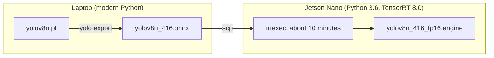
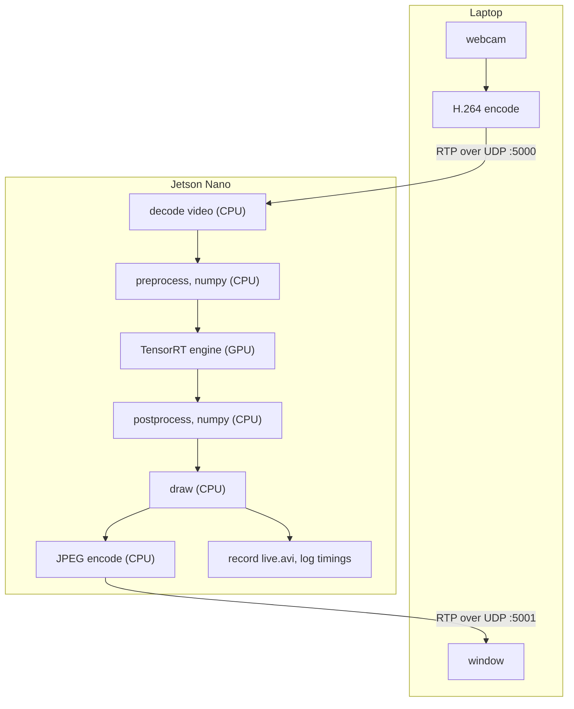

# jetson-nano-yolo-bench

Object detection on an original Jetson Nano, with a stopwatch on every step.


*A frame from the live run. The Nano is drawing these boxes on video that arrives from a laptop's webcam over the local network, because the board had no camera of its own. COCO has no class for a cap, so the model labels it a sports ball.*

## The short version

A Jetson Nano is a small computer with a GPU, built to run neural networks on about ten watts. This project runs YOLOv8n, the smallest YOLOv8 detector, trained on the 80 COCO classes, on one of them through TensorRT, and then asks a simple question: how fast is it really?

The answer depends on what you time.

| What was timed | Frames per second |
|---|---|
| The neural network by itself | 38.6 |
| The network, plus preprocessing and postprocessing | 19.6 |
| The whole live system, with video coming in and going back out | 12.3 |

It is the same model on the same board in all three rows. The first number is the one that usually gets quoted. The last one is what you actually get.

The surprise is where the time goes. The neural network was never the slow part. In the live system the GPU is working for about a third of each frame. For the rest, it waits while the Nano's four ARM cores resize images, run NMS over candidate boxes, and decode and encode video.

All the measurements, how they were taken, and the raw logs from the board are in [`bench/results.md`](bench/results.md).

## What a model gives you, and what it does not

A detection model does not take a photo and hand back boxes. It takes one tensor of a fixed shape and returns another.

For this model the input is `[1, 3, 416, 416]`: a batch of one, three colour channels, 416 by 416 pixels, float32 in the range 0 to 1. The output is `[1, 84, 3549]`. That is 3549 candidate boxes, each described by 84 numbers: four for the box (centre x, centre y, width, height) and one confidence score for each of the 80 classes. The 3549 comes from the three detection grids, 52 x 52, 26 x 26 and 13 x 13.

It returns all 3549 candidates for every image, even a blank wall. For the test photo, 3442 of them score below 0.01, 43 pass the 0.25 confidence threshold, and those 43 describe just 5 real objects, because neighbouring grid cells all fire on the same bus.

So there is real work on both sides of the model. Preprocessing has to turn a photo of any size into that exact input tensor without distorting it, which means letterboxing, a BGR to RGB swap, and HWC to CHW. Postprocessing has to turn 3549 candidates into 5 boxes, which means a confidence filter, IoU, and class-aware NMS. That work is [`common/yolo.py`](common/yolo.py), written in plain numpy, with the tensor shape noted on every line so it can be followed step by step.

It was checked against the Ultralytics pipeline using the same ONNX file. Both find the same five objects, with scores that agree to three decimal places and boxes that agree to within one pixel.

## How the pieces fit

Getting the model ready happens once. The Nano's Python is too old to install `ultralytics`, so the model is exported to ONNX on a laptop and only that file is sent across. The Nano then builds a TensorRT engine from it for its own GPU, which takes about ten minutes.



After that, this happens for every frame of video:



Count the boxes on the Nano's side. Six say CPU and one says GPU. That picture is the whole result of this project in one glance.

One design choice made everything else easier. `common/yolo.py` runs unchanged on the laptop and on the Nano. Only the step in the middle differs: the laptop runs the network with onnxruntime on its CPU, and the Nano runs it with TensorRT on its GPU. Because of that, the numpy code could be proven correct on the laptop first. After that, anything that went wrong on the board could only be the TensorRT part, which cut every later debugging problem in half.

## The board decided the design

On a workstation or in the cloud, a problem can be solved by adding memory, upgrading a driver, or picking a bigger machine. On a small board none of that is possible. The design ends up being whatever the device leaves room for, and nearly every choice in this project was made by a limit of the hardware.

**The software is frozen.** NVIDIA's last release for this board is JetPack 4.6, from 2021. That means Python 3.6 and TensorRT 8.0, for good. The `ultralytics` package needs a newer Python, so the export has to happen on a laptop, and it has to target an older ONNX opset (`opset=12`) that TensorRT 8.0 can still parse.

**The usual GPU library was missing.** Nearly every TensorRT tutorial moves data to the GPU with `pycuda`. It was not installed, and building it on the Nano takes a quarter of an hour. Only three operations were needed: allocate device memory, copy host to device, copy device to host. Those are `cudaMalloc` and `cudaMemcpy` in `libcudart`, which ships with JetPack, so [`nano/trt_runner.py`](nano/trt_runner.py) calls them directly through `ctypes`. It comes to about ten lines, and it shows exactly what happens where `pycuda` would have hidden it.

**There is only 4 GB, and the GPU shares it.** The Nano has no separate video memory. With the desktop running, more than half was already gone and the board was using swap before anything had started. Turning the desktop off took idle memory use from 2.3 GB to 276 MB, and only then did the model have room.

**There was no camera.** So a laptop's webcam stands in for one. The video is encoded as H.264, sent as RTP over UDP on the local network, and opened in OpenCV through a GStreamer pipeline as though it were a camera plugged into the board. The detection code never knows the difference.

**The hardware H.264 decode path could not be used,** so the stream is decoded in software with `avdec_h264`, on the same CPU that turned out to be the bottleneck.

**The board was borrowed, and it went down twice in the middle of long jobs.** A TensorRT engine build has no checkpoint, so the first one was simply lost. After that, the scripts were written to skip anything already finished, which makes rerunning them after an interruption cheap.

More on each of these in [`docs/design-notes.md`](docs/design-notes.md).

## What the measurements showed

**Convolutions are only 60% of GPU time.** They are the heavy arithmetic in the network, the part everyone pictures. The per-layer profile shows the engine running as 185 layers, and 40% of the time goes to the ones in between: pointwise activations, reshapes, copies.

**The slowest single layer is not a convolution at all.** It is the fused SiLU activation right after the first convolution, where the feature map is still at its largest, 16 x 208 x 208. It has no weights and very little arithmetic, and at 5.9% it takes more time than any other layer in the network.

**Part of every frame is a fixed cost.** Shrinking the image to 0.59 times as many pixels should have cut the time to 0.59. It cut it to 0.66. Working backwards from the two measurements, about 4.3 ms of each frame does not shrink with the image at all. That is roughly 23 microseconds for each of the 185 layers, which is about what a kernel launch costs from a slow CPU. This is an estimate from two measurements, and the results file says so.

**FP16 did not give half the time, and the reason is still open.** Building with `--fp16` made the engine file about half the size, but only 1.29 times faster than FP32. The tempting explanation is that the pointwise layers are memory-bandwidth bound. Two lines of arithmetic rule that out. Halving the precision halves the bytes moved, so a bandwidth-bound layer would have sped up too. And the slowest layer takes fifteen times longer than the Nano's 25.6 GB/s can account for. [`bench/results.md`](bench/results.md#6-open-question-why-fp16-gave-only-129x) lays out what is ruled out, what is still possible, and the one measurement that would have settled it.

**A smaller input is faster, and it costs you the hard cases.** At 320 pixels the engine is 1.5 times faster and finds four of the five objects. The one it loses is the hardest: a person half cut off at the edge of the photo, which scored only 0.29 at 416.

| 416 pixels: 5 objects | 320 pixels: 4 objects |
|---|---|
|  |  |

Look at the left edge of each photo. The partly hidden person has a box at 416 and none at 320.

## What is in the repository

| Path | What it is |
|---|---|
| [`common/yolo.py`](common/yolo.py) | Preprocessing and postprocessing in numpy and OpenCV: letterbox, output decoding, IoU, class-aware NMS. The part most worth reading. |
| [`nano/trt_runner.py`](nano/trt_runner.py) | Deserializes a TensorRT engine and handles host and device buffers through `ctypes`, without `pycuda`. |
| [`nano/detect_image.py`](nano/detect_image.py) | Runs one image through the engine, timing preprocess, inference and postprocess separately. |
| [`nano/detect_stream.py`](nano/detect_stream.py) | The live version: video in, boxes drawn, video back out, every frame timed. |
| [`nano/build_engines.sh`](nano/build_engines.sh), [`nano/bench.sh`](nano/bench.sh) | Build the engines one at a time, then benchmark them all the same way with `trtexec`. |
| [`laptop/run_onnx.py`](laptop/run_onnx.py) | The same detector on a laptop CPU with onnxruntime. No Jetson needed. |
| [`laptop/stream_webcam.sh`](laptop/stream_webcam.sh), [`laptop/view_result.sh`](laptop/view_result.sh) | GStreamer pipelines: send a webcam to the board, and show what comes back. |
| [`bench/`](bench/) | The results, and every raw log they came from. |
| [`docs/design-notes.md`](docs/design-notes.md) | The reasoning behind the build. |

## Trying it

### On a laptop, with no Jetson

This runs the full detector on a CPU. It is the quickest way to see `common/yolo.py` working.

```bash
python3 -m venv .venv && source .venv/bin/activate
pip install ultralytics onnxruntime opencv-python

mkdir -p models && cd models
yolo export model=yolov8n.pt format=onnx imgsz=416 opset=12 simplify=True
mv yolov8n.onnx yolov8n_416.onnx && cd ..

python laptop/run_onnx.py path/to/any.jpg
```

The export downloads the model by itself. Model files are not kept in this repository, for the reason given under [Licence](#licence).

### On a Jetson Nano with JetPack 4.6

Copy the folder to the board, then build the engines there. A TensorRT engine only runs on the GPU and TensorRT version that built it, so this step cannot be done on the laptop, however much faster the laptop is.

```bash
scp -r . user@<nano-ip>:~/jetson-nano-yolo-bench          # from the laptop
cd ~/jetson-nano-yolo-bench                                # then on the Nano

nohup bash nano/build_engines.sh > bench/logs/build.log 2>&1 &
python3 nano/detect_image.py path/to/any.jpg
bash nano/bench.sh
```

Each build takes about ten minutes and prints almost nothing while it works. It has not frozen. Leave the GPU alone during a build: TensorRT selects a kernel for each layer by timing the candidates on the real GPU, and a second job would corrupt those timings.

On a 4 GB Nano, turn the desktop off first with `sudo systemctl set-default multi-user.target` and reboot.

### Live video from a laptop webcam

Start these three in order. The first two wait quietly until the third begins sending.

```bash
python3 nano/detect_stream.py <laptop-ip>      # on the Nano
bash laptop/view_result.sh                     # on the laptop
bash laptop/stream_webcam.sh <nano-ip>         # on the laptop
```

If no window appears, `laptop/test_viewer.sh` sends a test pattern straight to the viewer. That tells you whether the problem is on the laptop or on the board.


## How far to trust the numbers

These come from one board on one day, in MAXN power mode, with dynamic clock scaling left on (no `jetson_clocks`). They are good to within a few percent.

The per-stage timings use a single photo. NMS takes longer when there are more detections in the scene, so a crowded image would shift the balance a little further towards the CPU.

The fixed-cost figure rests on two measurements. And the FP16 question is open because one measurement was never taken: a per-layer profile of the FP32 engine, to set beside the FP16 one.

## Licence

The code here is released under the MIT licence. See [`LICENSE`](LICENSE).

YOLOv8 weights are published by Ultralytics under AGPL-3.0, and that covers ONNX files exported from them, so none are included. The export command above creates them locally. The two bus photos in `docs/images/` are annotated copies of the sample image from the Ultralytics repository and are not covered by the MIT licence.
