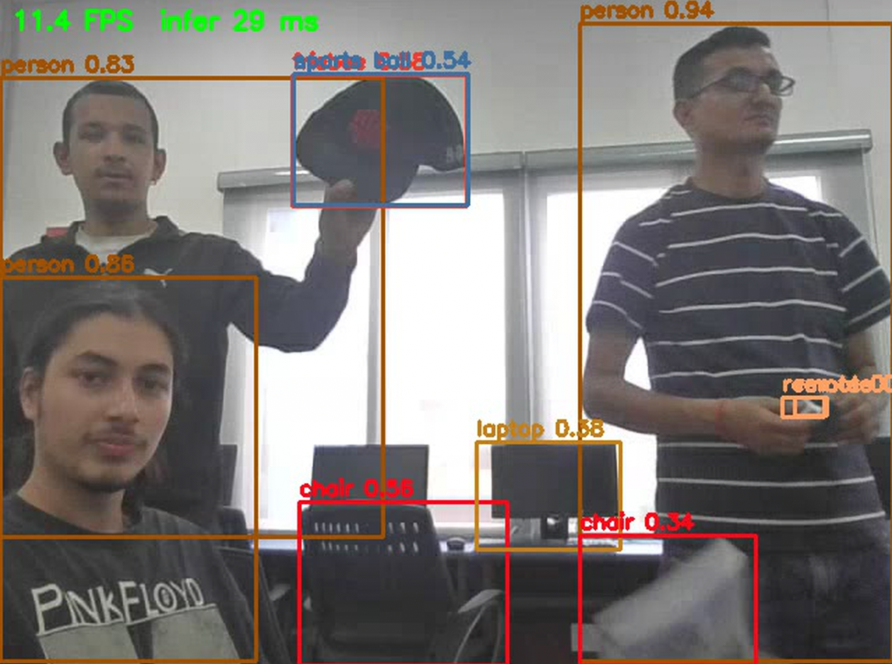
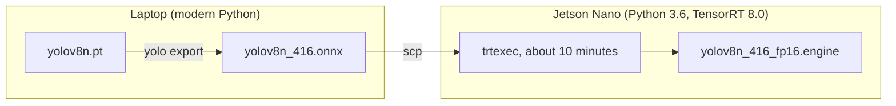
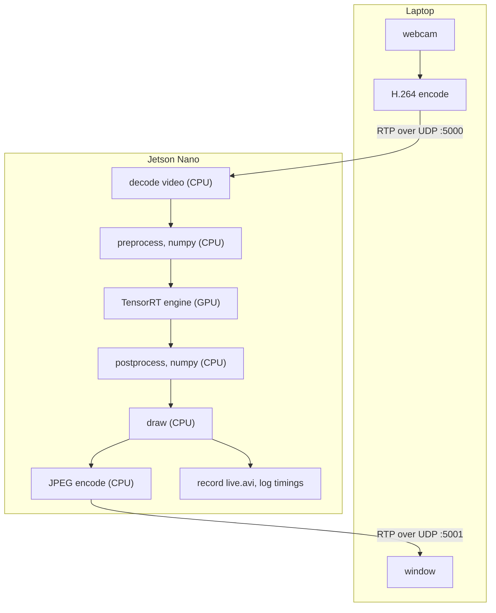
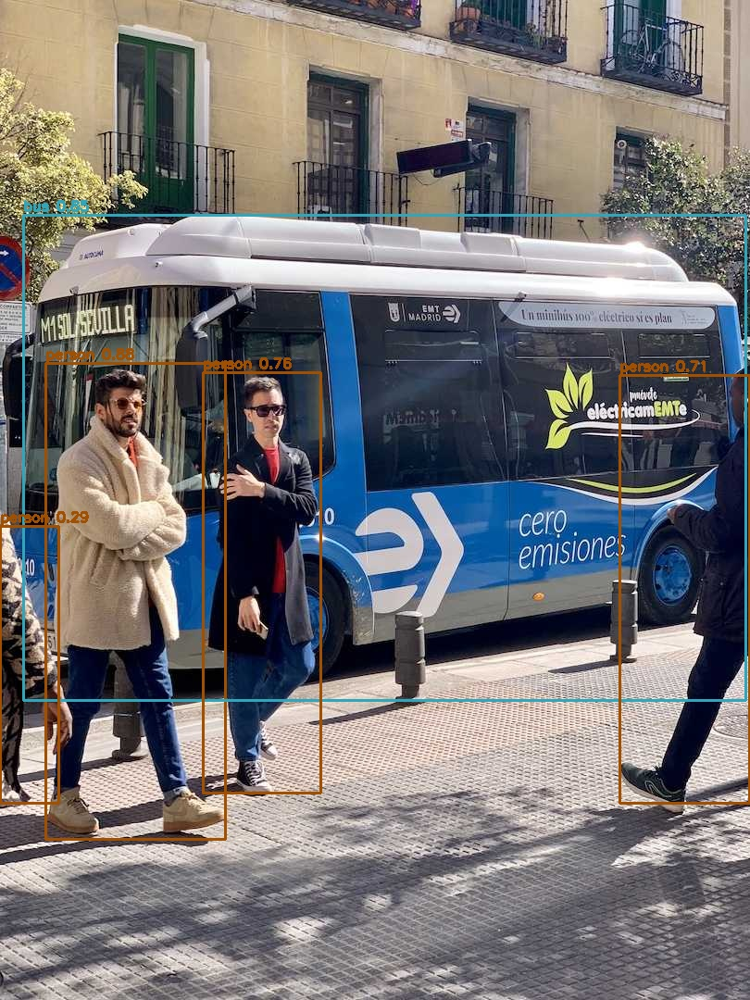
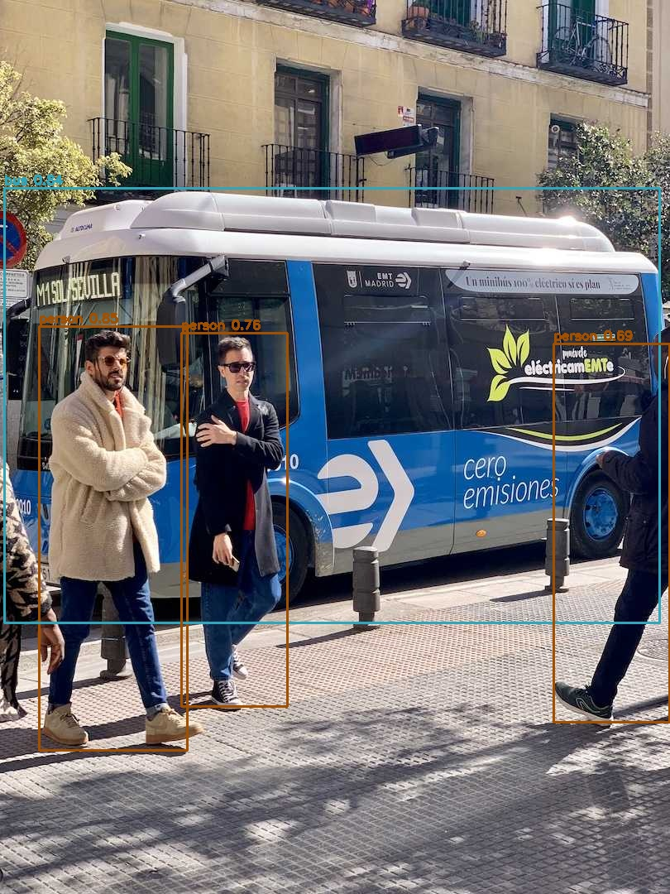

# jetson-nano-yolo-bench

Object detection on an original Jetson Nano, with a stopwatch on every step.



*A frame from the live run. The Nano is drawing these boxes on video that arrives from a laptop's webcam over the local network, because the board had no camera of its own. COCO has no class for a cap, so the model labels it a sports ball.*

## The short version

A Jetson Nano is a small computer with a GPU, built to run neural networks on about ten watts. This project runs YOLOv8n, the smallest YOLOv8 detector, on one of them through TensorRT, and then asks a simple question: how fast is it really?

The answer depends on what you time.

| What was timed | Frames per second |
|---|---|
| The neural network by itself | 38.6 |
| The network, plus preprocessing and postprocessing | 19.6 |
| The whole live system, with video coming in and going back out | 12.3 |

It is the same model on the same board in all three rows. The first number is the one that usually gets quoted. The last one is what you actually get.

The surprise is where the time goes. The neural network was never the slow part. In the live system the GPU is working for about a third of each frame. For the rest, it waits while the Nano's four ARM cores resize images, run NMS over candidate boxes, and decode and encode video.

Every measurement, how it was taken, and the raw logs from the board: [`bench/results.md`](bench/results.md).

## How the pieces fit

A detection model does not take a photo and hand back boxes. It takes one tensor, `[1, 3, 416, 416]`, and returns another, `[1, 84, 3549]`: 3549 candidate boxes for every image, of which a handful are real. The work on either side of it is [`common/yolo.py`](common/yolo.py), in plain numpy, with the tensor shape noted on every line.

Getting the model ready happens once. The Nano's Python is too old to install `ultralytics`, so the model is exported to ONNX on a laptop, and the Nano builds a TensorRT engine from that file.



After that, this happens for every frame of video:



Count the boxes on the Nano's side. Six say CPU and one says GPU. That picture is the whole result of this project in one glance.

`common/yolo.py` runs unchanged on both machines, with onnxruntime in the middle on the laptop and TensorRT on the Nano. So the numpy code was proven correct on the laptop first, against the Ultralytics pipeline, and anything that went wrong on the board could only be the TensorRT side.

## The board decided the design

On a small board you cannot add memory, upgrade a driver, or pick a bigger machine. The design ends up being whatever the device leaves room for.

| Limit of the device | What it forced |
|---|---|
| JetPack 4.6 is the last release for this board: Python 3.6, TensorRT 8.0 | Export on a laptop with `opset=12`, and send only the ONNX file across |
| `pycuda` not installed, and slow to build on the board | `cudaMalloc` and `cudaMemcpy` called directly through `ctypes`, in about ten lines |
| 4 GB shared by CPU and GPU, over half taken by the desktop | Boot headless first: idle memory use went from 2.3 GB to 276 MB |
| No camera | A laptop webcam streamed over the LAN, opened in OpenCV as a GStreamer pipeline |
| Hardware H.264 decode path unavailable | Software decode, on the CPU that was already the bottleneck |
| Borrowed board that went down twice mid-job | Build and benchmark scripts skip finished work, so rerunning is cheap |

The reasoning behind each row: [`docs/design-notes.md`](docs/design-notes.md).

## What the measurements showed

- **Convolutions are only 60% of GPU time.** The engine runs as 185 layers, and 40% goes to pointwise activations, reshapes and copies.
- **The slowest single layer is an activation, not a convolution:** the fused SiLU after the first convolution, at 5.9%.
- **About 4.3 ms of every 25.6 ms is fixed cost,** roughly 23 microseconds per layer. That is why 0.59 times the pixels gave 0.66 times the time. Estimated from two input sizes.
- **A 320 pixel input is 1.5 times faster and loses the hardest object** in the test photo, the half-visible person at the left edge.

| 416 pixels: 5 objects | 320 pixels: 4 objects |
|---|---|
|  |  |

**One question is still open: FP16 gave only 1.29 times over FP32.** The tempting explanation is that the pointwise layers are memory-bandwidth bound. Arithmetic rules that out: halving the precision halves the bytes moved, so such a layer would have sped up too, and the slowest layer takes fifteen times longer than the Nano's 25.6 GB/s can account for. [`bench/results.md`](bench/results.md#6-open-question-why-fp16-gave-only-129x) lists what is ruled out, what remains, and the one measurement that would settle it.

## What is in the repository

| Path | What it is |
|---|---|
| [`common/yolo.py`](common/yolo.py) | Preprocessing and postprocessing in numpy and OpenCV: letterbox, output decoding, IoU, class-aware NMS. The part most worth reading. |
| [`nano/trt_runner.py`](nano/trt_runner.py) | Deserializes a TensorRT engine and handles host and device buffers through `ctypes`, without `pycuda`. |
| [`nano/detect_image.py`](nano/detect_image.py) | Runs one image through the engine, timing preprocess, inference and postprocess separately. |
| [`nano/detect_stream.py`](nano/detect_stream.py) | The live version: video in, boxes drawn, video back out, every frame timed. |
| [`nano/build_engines.sh`](nano/build_engines.sh), [`nano/bench.sh`](nano/bench.sh) | Build the engines one at a time, then benchmark them all the same way with `trtexec`. |
| [`laptop/run_onnx.py`](laptop/run_onnx.py) | The same detector on a laptop CPU with onnxruntime. No Jetson needed. |
| [`laptop/stream_webcam.sh`](laptop/stream_webcam.sh), [`laptop/view_result.sh`](laptop/view_result.sh) | GStreamer pipelines: send a webcam to the board, and show what comes back. |
| [`bench/`](bench/) | The results, and every raw log they came from. |
| [`docs/design-notes.md`](docs/design-notes.md) | The reasoning behind the build. |

## Trying it

On a laptop, with no Jetson:

```bash
python3 -m venv .venv && source .venv/bin/activate
pip install ultralytics onnxruntime opencv-python

mkdir -p models && cd models
yolo export model=yolov8n.pt format=onnx imgsz=416 opset=12 simplify=True
mv yolov8n.onnx yolov8n_416.onnx && cd ..

python laptop/run_onnx.py path/to/any.jpg
```

On a Jetson Nano with JetPack 4.6. An engine only runs on the GPU and TensorRT version that built it, so the build has to happen on the board:

```bash
scp -r . user@<nano-ip>:~/jetson-nano-yolo-bench          # from the laptop
cd ~/jetson-nano-yolo-bench                                # then on the Nano

nohup bash nano/build_engines.sh > bench/logs/build.log 2>&1 &
python3 nano/detect_image.py path/to/any.jpg
bash nano/bench.sh
```

Each build takes about ten minutes and prints almost nothing while it works. Leave the GPU alone until it finishes: TensorRT selects a kernel for each layer by timing the candidates on the real GPU, and a second job would corrupt those timings.

Live video from a laptop webcam. Start these in order:

```bash
python3 nano/detect_stream.py <laptop-ip>      # on the Nano
bash laptop/view_result.sh                     # on the laptop
bash laptop/stream_webcam.sh <nano-ip>         # on the laptop
```

If no window appears, `laptop/test_viewer.sh` sends a test pattern straight to the viewer, which tells you whether the problem is on the laptop or on the board.

## How far to trust the numbers

- One board, one day, MAXN power mode, dynamic clock scaling left on (no `jetson_clocks`). Good to within a few percent.
- Per-stage timings use a single photo. NMS takes longer with more detections in the scene.
- The fixed-cost figure rests on two measurements.
- The FP16 question is open because the FP32 engine was never profiled per layer.

## Licence

The code here is released under the MIT licence. See [`LICENSE`](LICENSE).

YOLOv8 weights are published by Ultralytics under AGPL-3.0, and that covers ONNX files exported from them, so none are included. The export command above creates them locally. The two bus photos in `docs/images/` are annotated copies of the sample image from the Ultralytics repository and are not covered by the MIT licence.
