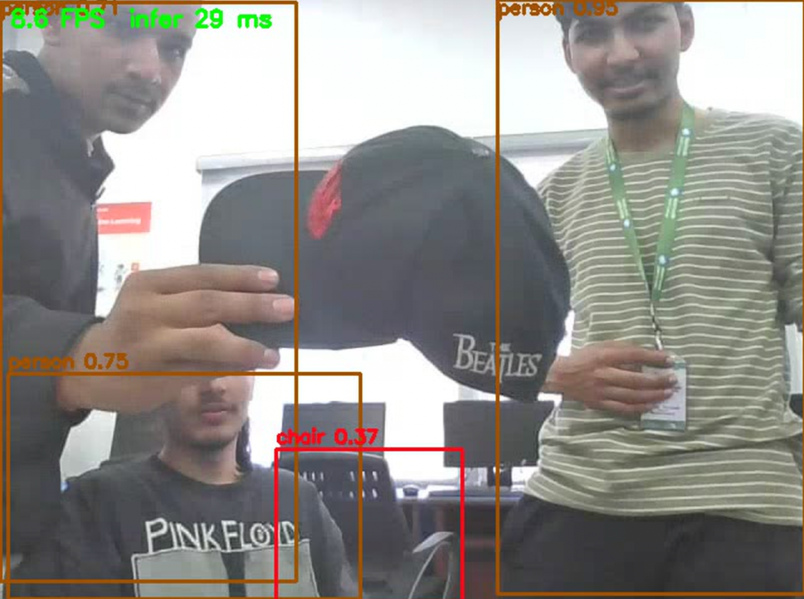

# Design notes

The reasoning behind the build. Almost every decision here traces back to something the board could not do, so the notes start with the board. Measurements are in [`../bench/results.md`](../bench/results.md).

## The board

Jetson Nano Developer Kit, 4 GB. A 128-core Maxwell GPU and four Cortex-A57 cores on one Tegra X1 chip, sharing one pool of LPDDR4 memory.

| Command | Result | Meaning |
|---|---|---|
| `cat /proc/device-tree/model` | NVIDIA Jetson Nano Developer Kit | The 2019 Nano, not an Orin Nano |
| `free -h` | 3.9G total | The 4 GB variant |
| `cat /etc/nv_tegra_release` | R32, REVISION 6.1 | L4T 32.6.1, which is JetPack 4.6: Ubuntu 18.04, Python 3.6, CUDA 10.2, TensorRT 8.0.1 |
| `sudo nvpmodel -q` | MAXN | The 10 W mode, all four cores |

JetPack 4.6.x is the last release for this board, so the software is frozen. Python 3.6 cannot install the `ultralytics` package or a current PyTorch. That single fact shapes the project: the model is prepared on a laptop, and the board only ever receives a file that no longer needs those libraries.

## Memory first

Before any model could run, the board needed room for it. With the desktop running, the board idled at 2.3 GB used with 1.2 GB already in swap. The GPU shares that memory, so a model would have had about 1.4 GB to work with.

| Change | Effect |
|---|---|
| `sudo systemctl set-default multi-user.target` | Idle use 2.3 GB to 276 MB, 3.4 GB available |
| A 4 GB swap file beside the existing 2 GB of zram | A safety net for engine builds, which peaked near 1.8 GB |

## Three file formats

The same network exists as three files, and each one is there for a reason.

| File | Made on | Notes |
|---|---|---|
| `yolov8n.pt` | downloaded | PyTorch weights. Needs PyTorch and `ultralytics` to run. |
| `yolov8n_416.onnx` | laptop | `imgsz=416` is baked into the file. `opset=12` because TensorRT 8.0 cannot read newer ONNX versions. |
| `yolov8n_416_fp16.engine` | the Nano | TensorRT times several kernels for every layer on the real GPU and keeps the fastest, and fuses adjacent layers. The result is tied to that GPU and TensorRT version, so it must be built on the board. |

416 and 320 are both multiples of 32, which the network needs because it halves the image five times.

## One file, two machines

`common/yolo.py` runs unchanged on the laptop and on the Nano. Only the step in the middle differs: the laptop executes the network with onnxruntime on its CPU, and the Nano executes it with TensorRT on its GPU.

That was deliberate. Postprocessing bugs are hard to spot, because wrong boxes still look plausible. On the laptop the numpy code could be compared directly with the Ultralytics pipeline on the same ONNX file, and it matches: the same five detections, scores equal to three decimals, boxes within one pixel. Once that was established, anything that went wrong on the board could only be on the TensorRT side. It halved every later debugging problem before it happened.

It also sets a constraint. Everything in `common/` and `nano/` has to run on the Nano's Python 3.6 and numpy 1.13, so there are no f-string debug specifiers, no `np.take_along_axis`, no dataclasses.

## The two tensors

The model's whole contract with the outside world is two shapes.

Input `[1, 3, 416, 416]`: one image, RGB, float32 in 0..1, letterboxed onto a grey (114) square so the aspect ratio is kept.

Output `[1, 84, 3549]`: 3549 candidate boxes of 84 numbers each.

- 3549 = 52 x 52 + 26 x 26 + 13 x 13. One candidate per cell of three grids, at strides 8, 16 and 32.
- 84 = 4 box numbers (centre x, centre y, width, height, in input pixels) + 80 COCO class scores, already passed through a sigmoid. YOLOv8 has no objectness score and needs no anchor decoding; that is inside the exported graph.

The model returns all 3549 candidates for every image. For the test photo, 3442 score under 0.01, 43 pass the 0.25 threshold, and NMS reduces those to 5.

## Class-aware NMS in one call

A person standing in front of a bus overlaps the bus heavily, and plain NMS can delete one of them. Before NMS, every box is shifted by `class_id * 7680` pixels. Boxes of different classes can then never overlap, while boxes of the same class keep their overlaps. One NMS call handles all 80 classes. The shift is used only inside that call.

## No pycuda

The GPU cannot see a numpy array. The array lives in host memory, the engine reads and writes device memory, and the two are separate address spaces even though the Nano's CPU and GPU share the same physical chips. So each inference is three steps: copy in, run, copy out. `pycuda` is the usual way to do that from Python. It was not installed, and building it on the Nano takes 10 to 15 minutes.

The three operations needed are functions in `libcudart.so`, which ships with JetPack. `nano/trt_runner.py` calls `cudaMalloc`, `cudaMemcpy` and `cudaFree` through `ctypes`. Buffers are allocated once and reused for every frame.

This is why `preprocess` ends with `np.ascontiguousarray`. `transpose` only changes how numpy walks the memory, and a raw `cudaMemcpy` copies bytes in their physical order.

The code targets TensorRT 8.0, which uses the binding API (`get_binding_shape`, `execute_v2`). TensorRT 8.5 and later use named tensors instead.

## A camera over the LAN

The board had no camera, so a laptop webcam is sent to it as H.264 in RTP over UDP, and annotated frames come back as JPEG in RTP. Each choice in that sentence has a reason.

- H.264 for the camera stream because raw 640 x 480 video at 30 FPS is about 221 Mbit/s. The stream is 2 Mbit/s.
- `tune=zerolatency` and a keyframe every second, so the receiver can join or recover within a second.
- UDP because a late video packet is worthless, and TCP would stall the stream to resend it.
- OpenCV opens the GStreamer receive pipeline as if it were a camera, so the detection loop is identical to the single-image path.
- `appsink drop=true max-buffers=1`: the camera produces 30 FPS and the detector about 12. Without this, frames queue up and the picture falls further behind every second. With it, the loop always gets the newest frame.
- JPEG for the return path because software H.264 encoding would cost more CPU, and the CPU is the bottleneck.
- Software decode with `avdec_h264`. The Nano has a dedicated H.264 decoder that does not use the GPU cores, but the GStreamer element needed to reach it from this pipeline, `nvvidconv`, was reported missing when checked over SSH. That was not investigated. At 640 x 480 the CPU decoder keeps up, at the cost of CPU time on a board where the CPU is the scarce resource.

*A second frame from the live run. The overlay in the corner is drawn by the detection loop: the frame rate of the whole loop, and the inference time for that frame.*

### A silent failure worth recording

The first return pipeline, `appsrc ! videoconvert ! jpegenc ! rtpjpegpay ! udpsink`, ran without errors and sent no packets. JPEG over RTP accepts only certain colour layouts. `videoconvert` and `jpegenc` negotiated one it does not, and `rtpjpegpay` dropped every frame with a warning (`Invalid component`) that quiet mode hid. A caps filter, `video/x-raw,format=I420`, before the encoder fixed it: 0 frames received before, 60 after, in the same test.

Two habits came out of it. Run a silent pipeline without `-q` before anything else. And count at every hop: packets sent, packets received, frames decoded, frames shown.

## Interruptions

The board was borrowed and went down twice in the middle of long jobs. An engine build has no checkpoint. The first one was lost to a power cut about six minutes in. `nano/build_engines.sh` skips engines that already exist and is started with `nohup`, so a dropped connection or a reboot costs at most the engine being built at the time. Builds run one at a time, because TensorRT selects kernels by timing them and a second GPU job would corrupt those timings.
